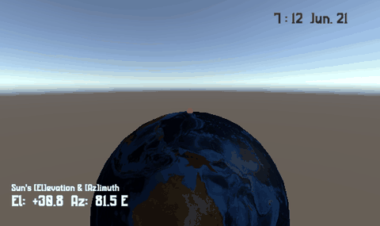
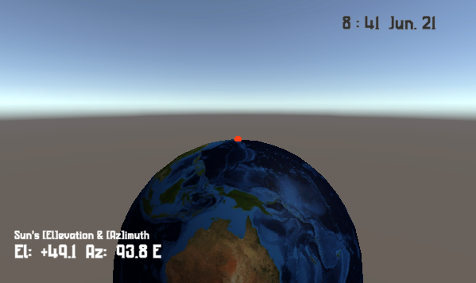
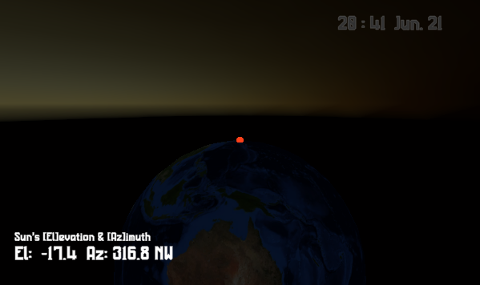

# Sunrise Sunset Simulator

[](https://creativecommons.org/licenses/by/4.0/)

日時と観測地（緯度・経度・時差）から太陽の高度・方位を計算し、Directional Light を太陽の向きに回して日の出・日没を再現する Unity プロジェクト。実時間でも、倍速の疑似時計でも動きます。

A Unity project that computes the sun's elevation and azimuth from date/time and observer position (latitude, longitude, UTC offset), drives a Directional Light accordingly, and reproduces sunrise and sunset — in real time or on a sped-up simulated clock.

<p align="center">
  
</p>
<p align="center"><sub>画面下の地球儀は観測地（赤い点＝東京）が天頂に来る向きで置いてあり、Directional Light の当たり方＝その場所の昼夜がそのまま地球儀の明暗になる。</sub></p>
<p align="center">
  
  
</p>

---

## 動作要件 / Requirements

| | |
| --- | --- |
| Unity | **6000.3.23f1**（Unity 6.3 LTS） |
| Render Pipeline | **URP 17.3.0**（`Assets/Settings/URP_Asset`） |
| UI | uGUI 2.0 ＋ TextMeshPro |

---

## 収録物 / Contents

| ファイル | 内容 |
| --- | --- |
| `Scripts/SunRotationGenerator.cs` | 静的クラス。地方時・緯度・経度・時差 → 太陽の高度・方位（NOAA Solar Calculator の式。大気差なし）。`SunLightRotation()` が Directional Light 用の回転 |
| `Scripts/SimulatorTester.cs` | 観測地と時計を持ち、ライトを太陽の向きに回して薄明で光量をフェード |
| `Scripts/ClockDirecter.cs` | 時計表示 |
| `Scripts/SunPositionHUD.cs` | 高度・方位・8 方位の表示（`El:  +45.2  Az: 178.3 S`） |
| `Tests/Editor/SunRotationGeneratorTests.cs` | 東京の四季の参照値（Python `astral`）と 0.5° 以内で一致することを確認する EditMode テスト |
| `Scenes/SampleScene.unity` | サンプル。Procedural Skybox＋Directional Light＋地球儀（`Sphere`）。地球儀は観測地が天頂（+Y）・観測地の北が +Z になる向きで置き、子の `ObserverMarker`（赤い点）が観測地 |
| `Textures/Earth_BlueMarble.png` / `Materials/Earth.mat` / `Materials/ObserverMarker.mat` | 地球儀のテクスチャ（NASA Blue Marble: Next Generation、2048×1024）とマテリアル。夜側が真っ黒にならないよう弱い Emission を入れてある |

（いずれも `Assets/RadianN/Products/Realtime SunSim/` 配下）

---

## 使い方 / Usage

`SampleScene` を開いて Play すると、PC の現在時刻で東京（35.69N, 139.69E, JST）の太陽が出ます。`Directional Light` の `SimulatorTester` で変えられます:

| 項目 | 内容 |
| --- | --- |
| `latitude` / `longitude` / `utcOffsetHours` | 観測地 |
| `useSystemClock` | `true` で PC の時刻。`false` で下の疑似時計 |
| `simulatedStart` / `timeScale` | 疑似時計の開始時刻（`yyyy-MM-dd HH:mm`）と倍速。`3600` で 1 秒＝1 時間 |
| `twilightDeg` / `maxIntensity` | 薄明の幅[deg] と最大光量 |

スクリプトから使うなら:

```csharp
var (el, az) = SunRotationGenerator.SunPosition(DateTime.Now, 35.69, 139.69, 9);
light.transform.rotation = SunRotationGenerator.SunLightRotation(el, az);
```

座標系は +Z = 北・+X = 東・+Y = 上、方位は北 0°・東 90°。観測地を変えたら、地球儀の向きとマーカー位置も合わせて回してください（`SimulatorTester` の緯度経度から `Quaternion.Inverse(Quaternion.LookRotation(北方向, 天頂方向))` で求まります。Unity 標準球はテクスチャの u=0.5 が +X、u が増えると +Z 側）。

---

## ライセンス / License

**CC BY 4.0** — 作者制作物（スクリプト・サンプルシーン・テスト・文書）はすべて対象です。詳細は [LICENSE](LICENSE)。

Everything authored here (scripts, the sample scene, tests and docs) is CC BY 4.0. See [LICENSE](LICENSE).

クレジット表記例 / Attribution:

```
Sunrise Sunset Simulator by RadianN_kswg / ラジアン（柏木主税） — CC BY 4.0
```

太陽位置の式は [NOAA Solar Calculator](https://gml.noaa.gov/grad/solcalc/)（米国政府著作物・パブリックドメイン）に従っています。
地球のテクスチャは NASA Earth Observatory の [Blue Marble: Next Generation](https://earthobservatory.nasa.gov/features/BlueMarble)（Reto Stöckli, NASA GSFC。米国政府著作物・パブリックドメイン）を縮小したものです。

### 第三者の収録物 / Third-party materials

本ライセンスの対象外で、それぞれのライセンスに従います。

| 収録物 | 作者・ライセンス |
| --- | --- |
| x14y24pxHeadUpDaisy（`Other Productions/Fonts/x0y0pxFreeFont/`・サブモジュール `hicchicc.github.io`。同梱のみでシーンでは未使用） | hicc / 患者長ひっく — [x0y0pxFreeFont](https://hicchicc.github.io/00ff/) 独自ライセンス |
| PenchantManufacture（`Other Productions/Fonts/PenchantManufacture/`・サブモジュール `PenchantManufacture_ImageAssets`） | RadianN_kswg / ラジアン（柏木主税） — [CC BY 4.0](https://github.com/radiann-kswg/PenchantManufacture_ImageAssets) |
| TextMesh Pro Essential Resources（`Assets/TextMesh Pro/`） | Unity Technologies — Unity Companion License（Liberation Sans: SIL OFL 1.1 / EmojiOne: CC BY 4.0 を含む） |

clone 後はフォントのサブモジュールを取得してください: `git submodule update --init`
